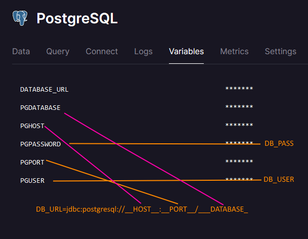
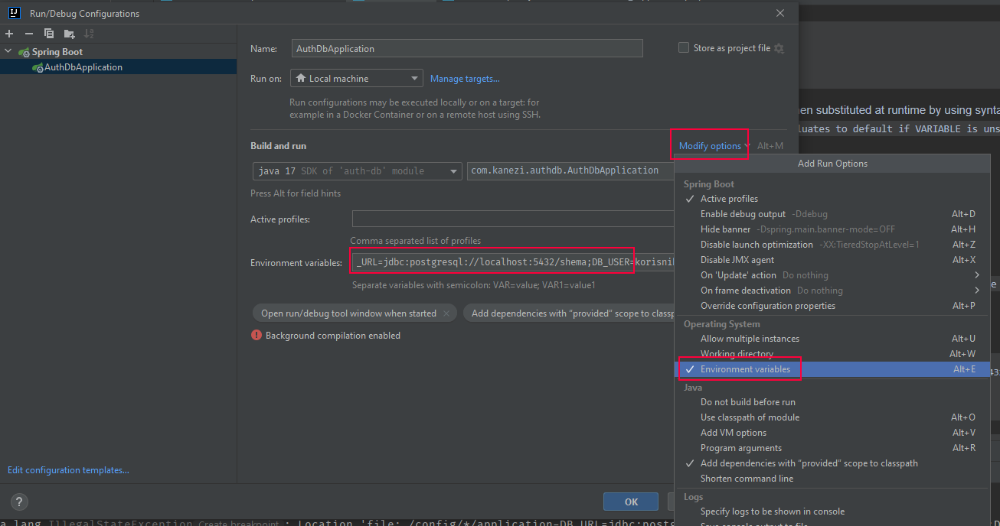

# Purpose of the project

* Secure spring app with username / password and Oath2 client provider login.
* Connect app to postgresql database

* deploy app to different cloud providers to test deployment


## SETUP

### DOCKER
docker-compose.yml provides required services setup for development.

```.env``` file in the same directory as docker-compose.yml is read by docker and enables definition of enviroment variables that will be substituted at runtime ba docker compose

example of content of *.env* file
```
DB_USER=your_user
DB_PASS=your_pass
DB_SCHEMA=your_schema
```

Environment variables are then substituted at runtime by using syntax:
```${VARIABLE:-default} evaluates to default if VARIABLE is unset or empty in the environment.```


### postgresql database

To connect to development postgresql database
1. define environemt variables ```.env``` file and apply them in ```application.properties```
2. run docker compose in the root of the project: ```docker compose up -d```
3. run spring boot app

Example of application properties:
```
spring.datasource.url=${DB_URL:jdbc:postgresql://localhost:5432/shema}
spring.datasource.username=${DB_USER:your_user}
spring.datasource.password=${DB_PASS:your_password}
```
```${VARIABLE:default} evaluates to default if VARIABLE is unset or empty in the environment.```

## DEPLOYING

### deploying on railway.app

Steps for deploying on railway.app
assuming you signed in using your gihub account hosting this app

1) create empty project
2) create postgresql database service
3) set up environment variables for database using variables from postgres service
4) deploy spring app from repo

#### how to set up database environment variables
Project expects *DB_URL*, *DB_USER* and *DB_PASS* environment variables.

Postgres jdbc database url is of format:
```jdbc:postgresql://__HOST__:__PORT__/___DATABASE_```

After deploying postgres service on railway you are automatically provided with variables for database service.
* *DB_USER*=**PGUSER**
* *DB_PASS*=**PGPASSWORD**
* *DB_URL*=jdbc:postgresql://**PGHOST**:**PGPORT**/**PGDATABASE**




IntelliJ enables definition of environment variables in run time configuration:


To shut down and remove volumes for docker container use: ```docker compose down -v```
